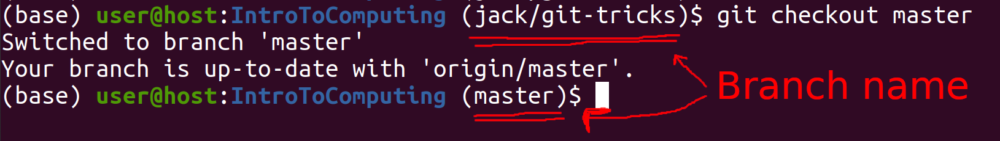
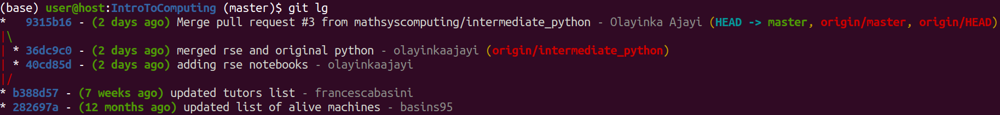

# Git materials
We will go through a simple guide to Git [(here)](https://rogerdudler.github.io/git-guide/) to introduce the basics. Feel free to mess around with Git and potentially use GitHub, but be careful - it is easy to lose data if you are unfamiliar with Git!

Here are a few cheat sheets for Git:

- [Git cheat sheet (Tobias Günther)](https://www.git-tower.com/blog/git-cheat-sheet/)
- [GitHub Git cheat sheet](https://github.github.com/training-kit/downloads/github-git-cheat-sheet.pdf)

## Other useful things
### Adding branch name to your prompt
When you start working on different branches, it is very easy to accidentally commit something to the wrong branch. You can mitigate this problem by putting the name of the current branch in your command prompt, as shown in the following picture. This way, you have a constant reminder of what branch you are on.


You can achieve this by following the instructions in the comments at the top of the following file:
https://github.com/git/git/blob/master/contrib/completion/git-prompt.sh

For step 2, your `.bashrc` refers to the file `~/.bashrc`, which is a setup script run in every terminal you open. You can use nano to edit this, but be careful not to change anything you don't mean to because you could break your laptop! It is good practice to make a copy of your `.bashrc` before you modify it, so that you can revert the changes if necessary.

Where it says "change your `PS1` to call `__git_ps1`" in step (3a), this means modifying how the `PS1` environment variable when it is defined in your `.bashrc`. Rather than using the one from their file, I suggest just adding it to the end of what already exists (but before the `\$`). For example, you might end up with something like
```bash
if [ "$color_prompt" = yes ]; then
    PS1='${debian_chroot:+($debian_chroot)}\[\033[01;32m\]\u@\h\[\033[00m\]:\[\033[01;34m\]\w\[\033[00m\]$(__git_ps1)\$ '
else
    PS1='${debian_chroot:+($debian_chroot)}\u@\h:\w$(__git_ps1)\$ '
fi
```

## Viewing the commit history
The default output of `git log` contains a lot of information, but is not that useful when you are trying to work out what happened in the past in git. It is often much more useful to see a graph of the commit history instead.

To get this alias and two other, similar aliases, run the following:
```bash
git config --global alias.lg "log --graph --abbrev-commit --decorate --format=format:'%C(bold blue)%h%C(reset) - %C(bold green)(%ar)%C(reset) %C(white)%s%C(reset) %C(dim white)- %an%C(reset)%C(auto)%d%C(reset)'"
git config --global alias.lg2 "log --graph --abbrev-commit --decorate --format=format:'%C(bold blue)%h%C(reset) - %C(bold cyan)%aD%C(reset) %C(bold green)(%ar)%C(reset)%C(auto)%d%C(reset)%n          %C(white)%s%C(reset) %C(dim white)- %an%C(reset)'"
git config --global alias.lg3 "log --graph --abbrev-commit --decorate --format=format:'%C(bold blue)%h%C(reset) - %C(bold cyan)%aD%C(reset) %C(bold green)(%ar)%C(reset) %C(bold cyan)(committed: %cD)%C(reset) %C(auto)%d%C(reset)%n          %C(white)%s%C(reset)%n          %C(dim white)- %an <%ae> %C(reset) %C(dim white)(committer: %cn <%ce>)%C(reset)'"
```

## Diffing notebooks
Tracking notebooks in git can be painful because `git diff` will usually be full of characters representing changes to plots generated as cell outputs. Thankfully, a tool called _nbdime_ exists to show you what you want to see. To find out more, see: https://nbdime.readthedocs.io/

